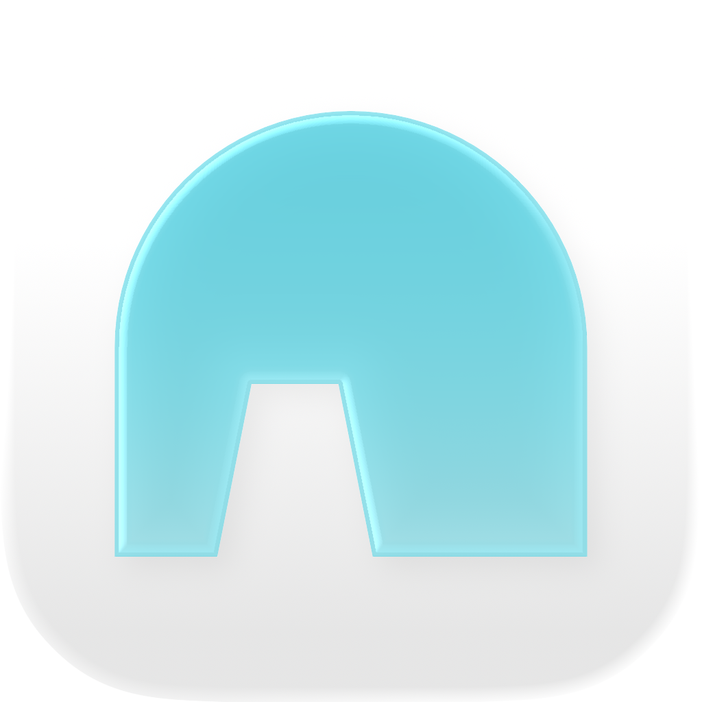
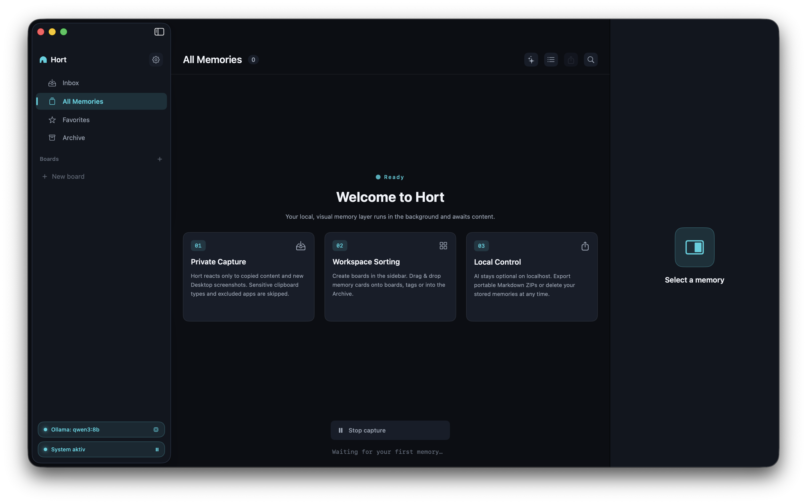

<div align="center">



# Hort

**A local-first visual memory layer for macOS.**

Capture what you copy and screenshot into a calm, searchable card feed.  
Organise, find and export it later. No accounts, no cloud, no telemetry.

[](#build--run)
[](LICENSE)
[](https://github.com/gedankenlust/Hort/releases)
[](https://developer.apple.com/swiftui/)
[-000000?style=flat-square&logo=ollama&logoColor=white)](https://ollama.com)
[](https://github.com/gedankenlust/Hort/pulls)

[**Download the latest App**](https://github.com/gedankenlust/Hort/releases) · [What it does](#what-it-does) · [Local AI](#local-ai-optional-fully-on-device) · [Privacy](#privacy--security) · [Build](#build--run)

</div>

---

<p align="center">
  
</p>

> It is not important to know how something works. It is important to know where it is.

Not a clipboard manager, not a notes app, not an AI assistant. Just a persistent
memory dashboard you can leave open on a second monitor.

*(Deutsche Version weiter unten, [zum deutschen Teil springen](#hort-deutsch).)*

---

## English

### Download & Install

**Just want to use Hort?** Download the latest **`Hort-1.0.0.zip`** from the
[Releases](https://github.com/gedankenlust/Hort/releases) page, unzip it, and
move **Hort.app** into your **Applications** folder.

**First launch (the app is open-source and unsigned):** macOS refuses to open it
the first time because it is not from an "identified developer". This is
expected. To allow it:

- **macOS 15 (Sequoia) or newer:** double-click Hort, dismiss the warning, then
  open **System Settings → Privacy & Security**, scroll down, and click
  **"Open Anyway"**. Confirm once.
- **Older macOS:** **right-click (or Control-click) Hort.app → "Open"**, then
  click **"Open"** in the dialog.
- **If macOS says the app is "damaged" (Apple Silicon):** clear the quarantine
  flag once in Terminal:
  ```sh
  xattr -dr com.apple.quarantine /Applications/Hort.app
  ```

You only need to do this once per install or update. Hort is not notarized
because it ships without a paid Apple Developer account. Everything still runs
100% locally on your Mac.

**Requirements:** macOS 14 or newer. The AI features are optional and need a
local [Ollama](https://ollama.com) install.

---

### What it does

Hort runs in the background and turns your digital context into **Memory
Objects**, visual cards in a live feed:

- **Capture:** automatically saves clipboard **text**, **URLs** (with the right
  type detection) and **images**, plus macOS **screenshots** from your Desktop.
- **Organise:** new captures land in the **Inbox**; drag a card onto one of
  your own **Boards** (create your own), add **Tags**, mark **favourites**, or
  **archive** what you're done with. **All Memories** is the full stream.
- **Retrieve:** instant search across content, source app and tags. Keyword
  search (SQLite FTS5) is fused with **semantic search** (local embeddings) so
  you find things by meaning too; filter the feed by board or tag from the
  sidebar.
- **Export:** package the memories you're viewing into an **Obsidian-friendly
  ZIP**: one markdown file per memory (with frontmatter) plus an `assets/`
  folder with relatively-linked images.

Cards support **multi-select** (⌘-click) for bulk archive/delete.

### How it works

1. A background **Capture Engine** polls the clipboard (~2×/second) and watches
   your Desktop for new screenshots.
2. Each capture becomes a **Memory Object** stored in **SQLite** (the source of
   truth). Images are saved as assets and a thumbnail is generated for the card
   preview.
3. The **dashboard** (the main window) renders the live feed. Selecting a card opens
   the **Inspector** on the right with its metadata, content and actions
   (favourite, copy, export to markdown, archive, delete, tags).
4. The **sidebar** navigates between Memory Feed, Capture Hub (unfiled),
   Archive, Boards and Tags. Drag a card onto a board, tag or Archive to file it.

### Local AI (optional, fully on-device)

Hort can use a local [Ollama](https://ollama.com) instance for AI features.
**Off by default, opt-in in Settings, and nothing ever leaves your machine.**

- **Analyse:** generate a short summary and suggested tags for a memory, on
  demand from the Inspector or automatically via **Autopilot**.
- **Semantic search:** every memory is embedded locally so search matches by
  meaning, fused with keyword search.
- **Ask your memory:** ask a question (✨ in the feed header or ⌘L) and get a
  streamed, **source-cited** answer drawn only from your own captures.

Everything runs against models on your own machine; retrieved notes are treated
strictly as data, never as instructions.

### Privacy & Security

**Hort is local-first.** This means your data never leaves your computer. There are no accounts, no cloud sync, no tracking, and no telemetry.

*   **You control the data:** Everything is stored in a local SQLite database on your machine.
*   **No "Surveillance":** Hort does not record your screen or log your keystrokes. It only reacts to two specific user actions:
    1.  When you **copy** something to your clipboard (Cmd+C).
    2.  When a **new screenshot file** appears on your Desktop.
*   **Sensitive Data Protection:** Hort automatically ignores content from password managers (like 1Password or Bitwarden) and skips clipboard items marked as "concealed" or "sensitive" by the system.
*   **App Exclusion:** You can define a list of apps that Hort should completely ignore.
*   **AI stays local & opt-in:** All AI features use a local Ollama instance, are off by default, and send nothing to any cloud.
*   **No content in logs:** Captured text, URLs and OCR are never written to the system log (debug builds log lengths only).
*   **Out of backups:** Hort's data folder is excluded from Time Machine / iCloud backups by default.
*   **Transparency:** You can see exactly what was captured in the feed and delete anything at any time.

---

### How Screenshot Capture Works

Screenshots still land on your Desktop. **This is intentional and correct.**

Hort does not replace the macOS screenshot tool. Instead, it "watches" your Desktop folder like a silent assistant.

1.  **You take a screenshot:** You press `Shift+Cmd+4`. macOS creates a file (e.g., `Screenshot 2026-06-11 at 10.00.00.png`) on your Desktop.
2.  **Hort notices the file:** Hort sees that a new file starting with "Screenshot" has appeared.
3.  **Hort creates a "Memory":** It indexes the image, runs OCR (text recognition) so you can search for words inside the image later, and displays it in your dashboard feed.
4.  **The file stays where it is:** The original file remains on your Desktop. Hort doesn't move or delete your files without permission.

**Why it might not have appeared instantly:**
*   **Timing:** Hort waits about 0.4 seconds after the file appears to make sure macOS has finished writing the image to disk.
*   **Permissions:** On the first launch, macOS asks for "Desktop Folder" access. If this was denied, Hort cannot see the files. You can check this in *System Settings > Privacy & Security > Files and Folders*.
*   **Naming:** Hort looks for files that contain the word "Screenshot" or "Bildschirmfoto" (for German systems). It is designed to work out-of-the-box with standard macOS naming conventions.

---

### Where it stores data

Everything lives locally under **`~/Library/Application Support/Hort/`**:

| Path | Contents |
| --- | --- |
| `~/Library/Application Support/Hort/database/hort.sqlite` | SQLite database, the source of truth (memories, FTS5 search index, semantic vector index) |
| `~/Library/Application Support/Hort/assets/` | Full-size captured images |
| `~/Library/Application Support/Hort/thumbnails/` | Generated card thumbnails |
| `~/Library/Application Support/Hort/exports/` | Single-memory markdown exports (from the Inspector) |

ZIP exports are written to wherever you choose in the save dialog. Settings
(capture on/off, privacy toggles, excluded apps) are stored in macOS
**UserDefaults** under the bundle id `dev.hort.app`.

### Keyboard shortcuts

| Shortcut | Action |
| --- | --- |
| ⌘1 / ⌘2 / ⌘3 / ⌘4 | Inbox / All Memories / Favorites / Archive |
| ⌘F | Search |
| ⌘L | Ask your memory |
| ⌘E | Export shown memories |
| ⌘⌫ | Delete selected memories |
| ⌘, | Settings |

### Build & run

Requirements: macOS 14+, Swift toolchain (Xcode command line tools).

```sh
# Build a proper .app bundle into dist/
Scripts/build-app.sh

# Build and install to /Applications
Scripts/build-app.sh release install

# Debug build
Scripts/build-app.sh debug

# Run the tests
swift test
```

### Tech stack

Swift · SwiftUI · SQLite via [GRDB](https://github.com/groue/GRDB.swift) ·
FTS5 full-text search · optional local AI via [Ollama](https://ollama.com)
(embeddings + LLM, hybrid search & RAG) · native macOS (no Electron, no web
views, no cloud).

### Project layout

```
App/        App entry point
Core/       Models, theme, engines (memory, files, images), vector math, settings
Services/   Capture engine, clipboard & screenshot monitors
AI/         Local AI: Ollama client, autopilot runtime, embedding indexer, RAG engine
Database/   SQLite setup (GRDB)
UI/         SwiftUI views (dashboard feed, sidebar, inspector, settings, ask, cards)
Export/     Markdown + ZIP export
Tests/      XCTest suite
Scripts/    build-app.sh
```

---

<a name="hort-deutsch"></a>

## Deutsch

Eine **local-first visuelle Gedächtnis-Schicht für macOS**. Hort erfasst im
Hintergrund, was du kopierst und screenshottest, und leitet es in ein ruhiges,
taktisches Dashboard (den **Hort**), wo du es später organisieren, durchsuchen,
wiederfinden und exportieren kannst, ohne deinen Arbeitsfluss zu unterbrechen.

> Es ist nicht wichtig zu wissen, wie etwas funktioniert. Wichtig ist zu wissen, wo es ist.

Kein Clipboard-Manager, keine Notiz-App, kein KI-Assistent. Nur ein dauerhaftes
Gedächtnis-System, das du auf einem zweiten Monitor offen lassen kannst.

### Download & Installation

**Willst du Hort einfach nutzen?** Lade die aktuelle **`Hort-1.0.0.zip`** von der
[Releases](https://github.com/gedankenlust/Hort/releases)-Seite, entpacke sie und
zieh **Hort.app** in deinen **Programme**-Ordner.

**Erster Start (die App ist quelloffen und unsigniert):** macOS verweigert den
ersten Start, weil die App nicht von einem "verifizierten Entwickler" stammt.
Das ist normal. So erlaubst du sie:

- **macOS 15 (Sequoia) oder neuer:** Hort doppelklicken, Warnung schließen, dann
  **Systemeinstellungen → Datenschutz & Sicherheit** öffnen, nach unten scrollen
  und auf **"Trotzdem öffnen"** klicken. Einmal bestätigen.
- **Ältere macOS:** **Rechtsklick (oder Ctrl-Klick) auf Hort.app → "Öffnen"**,
  dann im Dialog auf **"Öffnen"**.
- **Falls macOS sagt, die App sei "beschädigt" (Apple Silicon):** einmal im
  Terminal das Quarantäne-Flag entfernen:
  ```sh
  xattr -dr com.apple.quarantine /Applications/Hort.app
  ```

Das ist nur einmal pro Installation oder Update nötig. Hort ist nicht
notarisiert, weil es ohne kostenpflichtigen Apple Developer Account ausgeliefert
wird. Alles läuft trotzdem zu 100 % lokal auf deinem Mac.

**Voraussetzungen:** macOS 14 oder neuer. Die KI-Funktionen sind optional und
benötigen ein lokales [Ollama](https://ollama.com).

---

### Was sie macht

Hort läuft im Hintergrund und macht aus deinem digitalen Kontext **Memory
Objects**, visuelle Karten in einem Live-Feed:

- **Erfassen:** speichert automatisch **Text**, **URLs** (mit Typ-Erkennung) und
  **Bilder** aus der Zwischenablage sowie macOS-**Screenshots** vom Schreibtisch.
- **Organisieren:** neue Captures landen in der **Inbox**; zieh eine Karte auf
  eines deiner **selbst erstellten Boards**, vergib **Tags**, markiere
  **Favoriten** oder **archiviere** Erledigtes. **All Memories** ist der
  komplette Strom.
- **Wiederfinden:** sofortige Suche über Inhalt, Quell-App und Tags. Die
  Stichwortsuche (SQLite FTS5) wird mit **semantischer Suche** (lokale
  Embeddings) verschmolzen, sodass du auch nach Bedeutung findest; den Feed
  über die Sidebar nach Board oder Tag filtern.
- **Exportieren:** die gerade angezeigten Memories als **Obsidian-kompatibles
  ZIP** packen: eine Markdown-Datei pro Memory (mit Frontmatter) plus einen
  `assets/`-Ordner mit relativ verlinkten Bildern.

Karten unterstützen **Mehrfachauswahl** (⌘-Klick) zum Archivieren/Löschen mehrerer.

### Wie sie funktioniert

1. Eine **Capture Engine** im Hintergrund prüft die Zwischenablage (~2×/Sekunde)
   und überwacht den Schreibtisch auf neue Screenshots.
2. Jede Erfassung wird ein **Memory Object** in **SQLite** (die Quelle der
   Wahrheit). Bilder werden als Asset gespeichert und ein Thumbnail für die
   Kartenvorschau erzeugt.
3. Das **Dashboard** (das Hauptfenster) zeigt den Live-Feed. Ein Klick auf eine Karte
   öffnet den **Inspector** rechts mit Metadaten, Inhalt und Aktionen (Favorit,
   Kopieren, Markdown-Export, Archivieren, Löschen, Tags).
4. Die **Sidebar** navigiert zwischen Memory Feed, Capture Hub (ungefiltert),
   Archiv, Boards und Tags. Eine Karte auf ein Board, einen Tag oder das Archiv
   ziehen ordnet sie zu.

### Lokale KI (optional, komplett auf dem Gerät)

Hort kann eine lokale [Ollama](https://ollama.com)-Instanz für KI-Funktionen
nutzen. **Standardmäßig aus, in den Einstellungen aktivierbar, und nichts
verlässt jemals deinen Rechner.**

- **Analysieren:** erzeugt eine kurze Zusammenfassung und Tag-Vorschläge für
  ein Memory, auf Knopfdruck im Inspector oder automatisch per **Autopilot**.
- **Semantische Suche:** jedes Memory wird lokal eingebettet, sodass die Suche
  nach Bedeutung trifft, verschmolzen mit der Stichwortsuche.
- **Frag dein Gedächtnis:** stell eine Frage (✨ im Feed-Header oder ⌘L) und
  bekomme eine gestreamte, **quellen-zitierte** Antwort, ausschließlich aus
  deinen eigenen Captures.

Alles läuft gegen Modelle auf deinem eigenen Rechner; abgerufene Notizen werden
strikt als Daten behandelt, nie als Anweisungen.

### Privatsphäre & Sicherheit

**Hort ist "Local-First".** Das bedeutet, deine Daten verlassen niemals deinen Computer. Es gibt keine Accounts, keine Cloud-Synchronisierung, kein Tracking und keine Telemetrie.

*   **Du hast die Kontrolle:** Alles wird in einer lokalen SQLite-Datenbank auf deinem Rechner gespeichert.
*   **Keine "Überwachung":** Hort filmt nicht deinen Bildschirm und loggt keine Tastatureingaben. Die App reagiert nur auf zwei spezifische Aktionen:
    1.  Wenn du etwas in die **Zwischenablage kopierst** (Cmd+C).
    2.  Wenn eine **neue Screenshot-Datei** auf deinem Schreibtisch erscheint.
*   **Schutz sensibler Daten:** Hort ignoriert automatisch Inhalte von Passwort-Managern (wie 1Password oder Bitwarden) und überspringt Elemente, die vom System als "privat" markiert sind.
*   **App-Ausschlussliste:** Du kannst festlegen, welche Programme Hort komplett ignorieren soll.
*   **KI bleibt lokal & optional:** Alle KI-Funktionen nutzen eine lokale Ollama-Instanz, sind standardmäßig aus und senden nichts in irgendeine Cloud.
*   **Keine Inhalte in Logs:** Erfasster Text, URLs und OCR werden nie ins System-Log geschrieben (Debug-Builds loggen nur Längen).
*   **Aus Backups ausgenommen:** Hort's Datenordner ist standardmäßig von Time Machine / iCloud-Backups ausgeschlossen.
*   **Transparenz:** Du siehst im Feed genau, was erfasst wurde, und kannst alles jederzeit löschen.

---

### Wie die Screenshot-Erkennung funktioniert

Screenshots landen weiterhin wie gewohnt auf deinem Schreibtisch. **Das ist so gewollt.**

Hort ersetzt nicht das macOS-eigene Screenshot-Tool, sondern "beobachtet" deinen Schreibtisch-Ordner wie ein stiller Assistent.

1.  **Du machst einen Screenshot:** Du drückst `Shift+Cmd+4`. macOS erstellt eine Datei (z.B. `Bildschirmfoto 2026-06-11 um 10.00.00.png`) auf dem Schreibtisch.
2.  **Hort bemerkt die Datei:** Hort erkennt, dass eine neue Datei mit dem Namen "Bildschirmfoto" (oder "Screenshot") erschienen ist.
3.  **Hort erstellt ein "Memory":** Die App indiziert das Bild, führt eine Texterkennung (OCR) durch (damit du später nach Text im Bild suchen kannst) und zeigt es in deinem Feed an.
4.  **Die Datei bleibt liegen:** Das Originalbild bleibt unangetastet auf deinem Schreibtisch liegen.

**Warum ein Screenshot eventuell nicht sofort erscheint:**
*   **Berechtigungen:** Beim ersten Start fragt macOS nach Zugriff auf den "Schreibtisch". Wurde dies abgelehnt, kann Hort die Dateien nicht sehen. Prüfbar unter *Systemeinstellungen > Datenschutz & Sicherheit > Dateien und Ordner*.
*   **Benennung:** Hort sucht nach Dateien, die "Screenshot" oder "Bildschirmfoto" im Namen tragen. Das entspricht dem macOS-Standard.

---

### Wo sie speichert

Alles liegt lokal unter **`~/Library/Application Support/Hort/`**:

| Pfad | Inhalt |
| --- | --- |
| `~/Library/Application Support/Hort/database/hort.sqlite` | SQLite-Datenbank, die Quelle der Wahrheit (Memories, FTS5-Suchindex, semantischer Vektor-Index) |
| `~/Library/Application Support/Hort/assets/` | Erfasste Bilder in voller Größe |
| `~/Library/Application Support/Hort/thumbnails/` | Generierte Karten-Thumbnails |
| `~/Library/Application Support/Hort/exports/` | Einzel-Markdown-Exporte (aus dem Inspector) |

ZIP-Exporte werden dorthin geschrieben, wo du es im Speichern-Dialog wählst.
Einstellungen (Erfassung an/aus, Privatsphäre-Schalter, ausgeschlossene Apps)
liegen in den macOS-**UserDefaults** unter der Bundle-ID `dev.hort.app`.

### Tastaturkürzel

| Kürzel | Aktion |
| --- | --- |
| ⌘1 / ⌘2 / ⌘3 / ⌘4 | Inbox / All Memories / Favoriten / Archiv |
| ⌘F | Suche |
| ⌘L | Frag dein Gedächtnis |
| ⌘E | Angezeigte Memories exportieren |
| ⌘⌫ | Ausgewählte Memories löschen |
| ⌘, | Einstellungen |

### Bauen & starten

Voraussetzungen: macOS 14+, Swift-Toolchain (Xcode Command Line Tools).

```sh
# Echtes .app-Bundle nach dist/ bauen
Scripts/build-app.sh

# Bauen und nach /Applications installieren
Scripts/build-app.sh release install

# Debug-Build
Scripts/build-app.sh debug

# Tests ausführen
swift test
```

### Tech-Stack

Swift · SwiftUI · SQLite via [GRDB](https://github.com/groue/GRDB.swift) ·
FTS5-Volltextsuche · optionale lokale KI via [Ollama](https://ollama.com)
(Embeddings + LLM, hybride Suche & RAG) · natives macOS (kein Electron, keine
WebViews, keine Cloud).

---

### License

Hort is released under the [MIT License](LICENSE).

---

*Hort is open source and contributor-friendly. The architecture is meant to
stay readable and extensible.*
